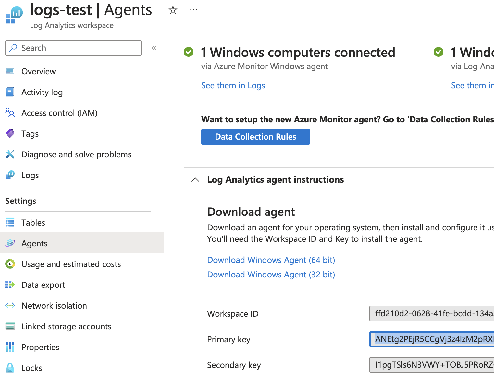
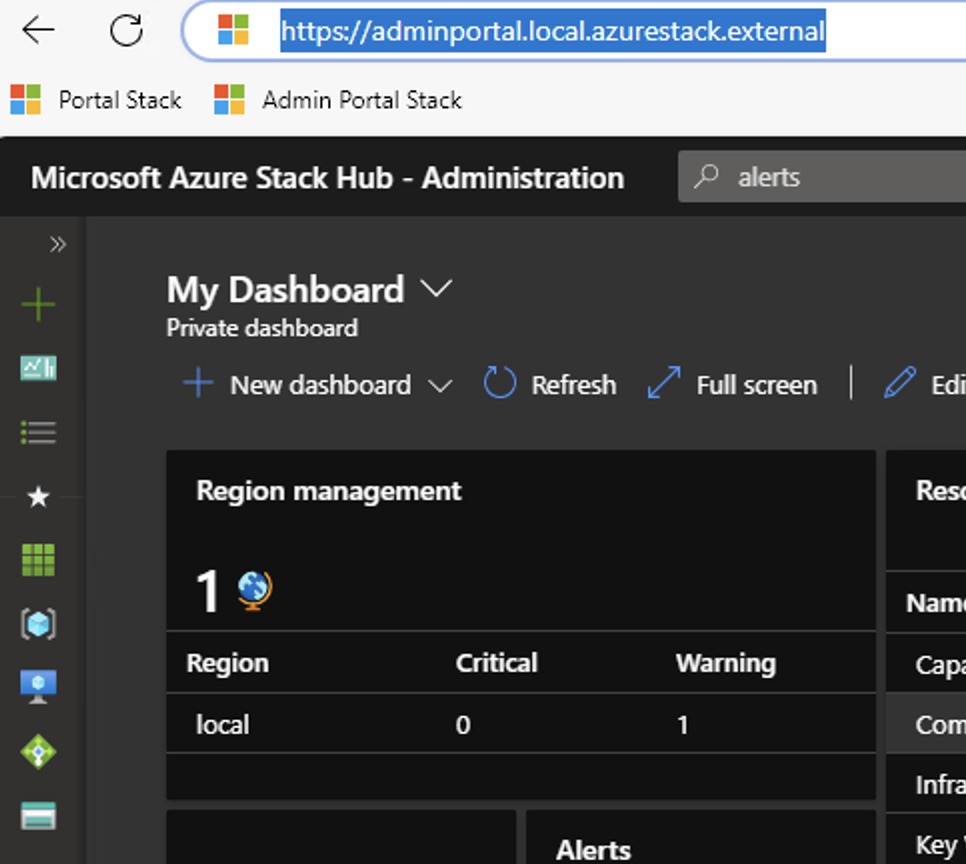
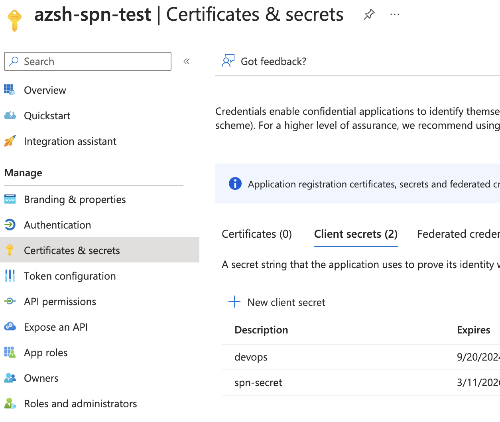
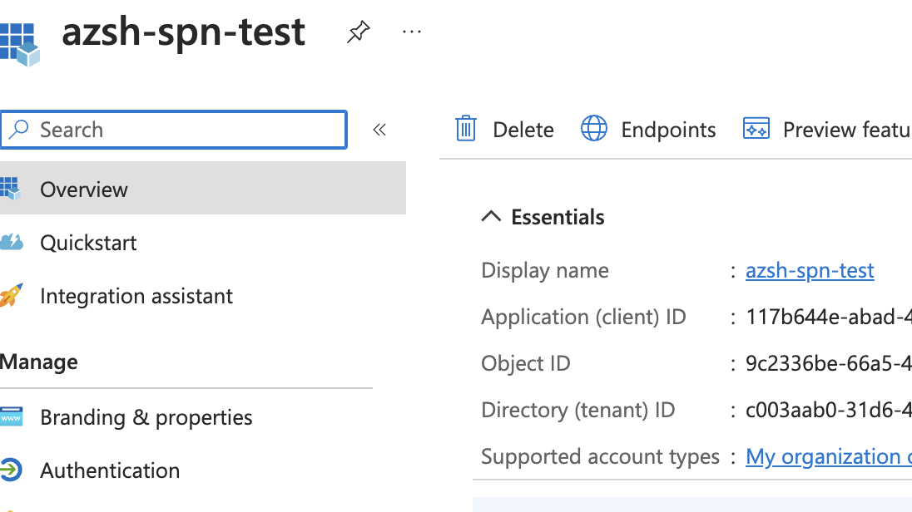

# Azure Stack HUB Alerts Collector
This repository contains a PowerShell script which loads log data from an Azure Storage Account and sends it into a Log Analytics Workspace.

### Target Platform: Azure Stack Hub Admin Portal

## Use case description
Alerts in Azure Stack HUB admin portal are only accessible from the Admin Portal. The script loads all active alerts and forwards them into a table in a Log Analytics Workspace for further processing.

## Server Prerequisites
- Windows Server with network access to Azure Stack Hub target storage account.
- PowerShell 5.1 with **Az** module.

**Tip!** to properly setup PowerShell to work with Azure Stack Hub follow this tutorial: https://learn.microsoft.com/en-us/azure-stack/operator/powershell-install-az-module?view=azs-2311.

## Running the script
### Prerequisites
In order to start collecting the data we first need to setup our config file.
We will need to get:
- Log Analytics Workspace ID (Azure)
- Log Analytics Workspace Key (Azure)
- URL of your Azure Stack Hub Admin Portal
- Service Principal with Read permissions on the Admin Portal Alerts.

**Log Analytics Workspace ID and Key**

Navigate to your Workspace in Azure and select 'Agents' section under 'Settings' in the left menu. Within the Agents settings expand 'Log Analytics agent instructions' and reveal the ID and Key.



**ARM_ENDPOINT - URL of the Admin Portal**

Login to the Azure Stack HUB Admin Portal and compy the base URL without https://.

**TENANT_NAME - Name of you Azure Tenant Domain**

Navigate to your Azure Portal account and copy the domain name value form your email address.
Example: Jogn.Doe@mydomain.onmicrosoft.com in this case TENANT_NAME equals to **mydomain.onmicrosoft.com**



**Service Principal with Read permissions**
Go to your public Azure Entra ID and create a new App Registration and generate a new secret.



In you Azure Stack Hub Default Provider Subscription grant this Application Reader permissions on the subscription.

Safe the App Registrations details: Client_ID, Client_Secret



### Prepare the config file
The script reads input data from a config file. This config file has a predifined structure and must be present and filled in order to collect the log table data.

The config file must be present in the same folder as the collector.ps1 script.

**Note!** If you run the script without the config file present, an empty config file will be created for you to fill in.

Fill in the config file with the data received from the previous steps.

**Example of a filled in config file**
```
WORKSPACE_ID:ffd210d2-0628-41fe-bcdd-1348888e14f
WORKSPACE_KEY:ANEtg2PEjR5CCgVj3z4lzM2pRXPh8W8888gJwSqpw3Czv5U5t221MZJZtHRSpui4qyaV0elS398oZzmdHcwvhQ==
ARM_ENDPOINT:adminmanagement.local.azurestack.external
TENANT_NAME:mydomain.onmicrosoft.com
CLIENT_ID:117b644e-abad-4d8e-5s4s-0a21ca6cab3d
CLIENT_SECRET:CgVj3z4lzM2pRXPh8W8888gJwSqpw3Czv5
```
### Run the script
After you have prepared the config file. You are ready to run the script. Moved the script and the config file to a dedicated server. Using the command line or PowerShell ISE run the collector.ps1 script.

### Run on schedule
In order to collect the data periodically use Task Manager in Windows to schedule a periodic script run.
Recommened interval is 5 minutes.

Set action in Task Scheduler to **Start a program** and set the value to: C:\Windows\System32\WindowsPowerShell\v1.0\powershell.exe Add Argument value with complete path to the collector.ps1 script like: "C:\Collector\collector.ps1" (example)
